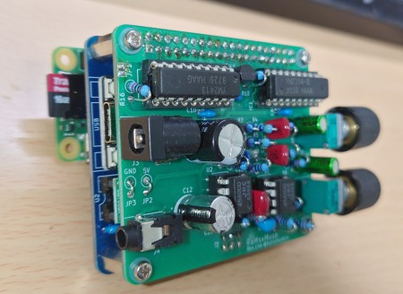
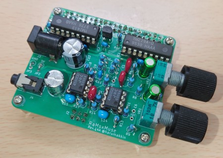
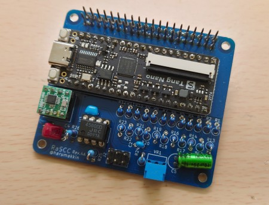

# RaMsxMuse
updated: 2022/11/15

<figure><figcaption>Fig.1 RaMsxMuse + RaSCC + RasPiZero2</figcaption></figure>

## これは何？
RaspberryPi用アドオンボードです。OPLL、PSG、SCC音源[^1]を搭載し、RaspberryPiに接続して音楽を奏でることができます。このアドオンボードはRaMsxMuseとRaSCCの二枚の基板から構成されており、回路図、ガーバーデータを公開していますので自由に製作、ご使用ください。MGSDRV.COM[^2]と専用エミュレータである[HopStepZ](https://github.com/cliffgraph/HopStepZ)を使用すれば、MGSデータを再生できます。
ただ、回路の素人が製作したものですので、音質には期待しないでください。

[^1]:OPLL=YM2413、PSG=YMZ234、SCC=Tang Nanoによる互換音源。YMZ294はPSG音源ではなくSSG音源と呼称するのが正しいようですが本稿では、PSG音源と呼称することとします。
[^2]:Gigamix Online, BGMドライバ・MGSDRV　MSXで楽しむチップチューン
https://gigamix.hatenablog.com/entry/mgsdrv/
(*4)WaveTableSound circuit for MSX, Copyright (c) 2021 HRA!
 https://github.com/hra1129/wave_table_sound

### RaMsxMuse(R14A)アドオンボード
- FM音源（OPLL YM2413 or YM2413B）と、PSG音源（YMZ294-D）を担当します。
- OPLL+PSGだけでよいという場合は、RaMsxMuseはRaspberryPiの組み合わせだけで使用できます。

<figure><figcaption>Fig.2 RaMsxMuse-R14A</figcaption></figure>

### RaSCC(R4A)アドオンボード
- SCC音源を担当します。
- 必ずRaMsxMuseと組み合わせて使用します。
- SCCはTangNano(FPGA)によるエミュレーションです。FPGAの回路はGitHubで公開されているWaveTableSound(*4)を一部修正して使用させてもらってます。
<figure><figcaption>Fig.3 RaSCC-R4A</figcaption></figure>

### 基板製造発注
私は、プリント基板製造サービス[FusionPCB](https://www.fusionpcb.jp/)を利用しています。RaMsxMuseを発注する場合は“RaMsxMuse_R14A_gerber.zip”を、RaSCCを発注する場合は”RaSCC_R4A_gerber.zip”を使用します。最小ロット5枚で、4.9ドルです(2022/11現在)。
RaMsxMuseとRaSCCを同時に発注して送料込みで、25ドルくらいでした（DHLを使用すると到着が早くなりますがもう少し高くなります）。発注が初めての人はガーバーデータ登録時の基板情報は下記を参考にしてください（私もよく理解していない部分がありますがこれで発注しています）
以前のRaMsxMuse(R10B)とRaSCC(R2B)のガーバーデータはビアの最小穴径が間違っていて下記の情報で発注できませんでした。RaMsxMuse(R10B)、RaSCC(R2B)では最小穴径を0.3mmに訂正しています。
```
材質：FR-4 TG 130
層数：二層
寸法：65*56
製造枚数：5
異種面付けの種類：１
板厚：1.60
レジスト色（基板の色）：お好みで、、、色によって価格、納期が多少変わります。
基板の表面処理：HASL
最小ソルダレジストダムの幅：0.4mm
銅箔圧：1oz
最小穴径：0.3mm
最小パターン幅／パターン間隔：6/6mil
端面スルーホール：なし
インピーダンス制御：なし
```

### 組立
部品表を参考に部品をそろえ実装してください。

### RaMsxMuse組立の注意点
- DCジャックの足を少し短くカットしてからはんだ付けしてください。そのままだとRaSCCの上に重ねたときにTangNanoのUSBコネクタ部に干渉します。RaSCCは使用しない場合は気にしなくてもよいです。
- RaSCCと組み合わせて使用する場合は、部品記号J2 の位置に実装する「6Pピンソケットメス3x2」（もしくは「3Pピンソケットメス3x1」を二個使用する）を基板背面に実装してください。これはRaSCCとの接続に使用されます。RaSCCは使わないよという場合は、実装しないでください。実装してしまうとこのピンソケットが邪魔でRaMsxMuseをRaspberryPiにアドオンできなくなります（実装してしまっても、40Pin GPIO Extenderケーブルを使用するという手もあります）

### RaSCC組立の注意点
- TangNanoを実装する前に、J3の「連結ピンソケット 2x20(40P)」を先にはんだ付けすることをおすすめします。
TangNanoはピンソケットを使用して実装すると、上に乗せるRaMsxMuseにぶつかってしまうので、TangNanoは直に基板へはんだ付けしてください。
- 部品記号C5の電解コンデンサも寝かせて実装してください。C5を実装する前にR13～R17の抵抗器とC5とが干渉しないようにうまく実装してください。
- RaSCC裏面のジャンパはオープンのままでOKです。
- 部品記号J1のピンヘッダは最後に時はんだ付けすることをおすすめします。RaMsxMuseのピンソケットメス側にピンヘッダを刺した状態でRaSCCにRaMsxMuseを載せてみてください。この状態でピンヘッダをRaSCCにはんだ付けしてください。ピンヘッダをなんのガイドもなしにはんだ付けすると意外に角度が付いてしまって、RaMsxMuseのピンソケットに入らないことがあります。
- TangNanoへの書き込みは、GOWIN FPGA Designer 付属の、GOWIN Programmer を使用します。設定は下記の通り。
Series：GW1N、Device：GW1N-1、Operation：embFlash Erase,Program,Verify、FS File：(wave_table_sound.fsファイルを選択します)。ケーブルセッティングのFrequencyは、15MHzを選んでください。
- ※wave_table_sound.fsファイルは、wave_table_sound_for_RaSCC_R4A.zipに圧縮されています。
※私のPC環境だけでしょうか、TangNanoへの書き込みは一回ではうまくいかないことがあります（ベリファイに失敗する）。その場合は、ケーブルセッティングのFrequencyを別の値に変更したり、OperationをembFlash Erase Only にして、何度も消去を繰り返したり、でようやく書き込めます。書き込み時のOperationは「embFlash Erase,Program,Verify」にして、必ずベリファイが実行されるようにしましょう。

### RaspberryPiの準備
- RaMsxMuse(R10B)+RaSCC(R2B)組み合わせでは、RaspberryPi 4 Mode B と、Raspberry Pi OS の64ビット版をおすすめしていましたが、RaMsxMuse(R14A)+RaSCC(R4A)では RaspberryPi Zero と 32ビットOSでもＯＫです。
- WiringPiのインストールを忘れないでください。
- HopStepZのソースコードを取得しビルドします
```sh
$ git clone https://github.com/cliffgraph/HopStepZ
$ make
```
- MGSDRV.COM（Ver3.20）を入手して、hopstepz を同じディレクトリに置いてください。MGSデータも任意の場所に格納してください。
- PLAYER.COM.HSZ ファイルも hopstepz と同じディレクトリに置いてください

### 利用方法
- RaspberryPiに、RaSCC、RaMsxMuseを載せます。
- RaMsxMuseの3.5mm小型ステレオミニジャックにイヤホンやスピーカーにつなぎます（内容はモノラル）。
- RaMsxMuse(R14A)を使用した場合は、２つの電源が必要になります[^3]。RaMsxMuseにDCジャック5Vを、RasberryPi本体のUSBに5Vを入れてください。DCジャックは、内径2.1mm、外径5.5mm、センタープラスです。
- hopstepz+MGSDRV.COMを実行します。
```sh
> $ ./hopstepz MGSDRV.COM <mgsファイルへのパス>
```
- 止めるときは、Ctrl+Cで止めます。

[^3]:RaMsxMuse(R14A)のJP1をショートすると１電源でも動作します。その場合はDCジャックかUSBケーブルどちらかだけの給電にしてください。だだし１電源で運用ではノイズがひどく出ます。このノイズを対策することが私はできませんでした。


### おことわり
このアドオンボードは素人作品ですので、音質は期待しないでください。品質も保証できません。それを了承のうえでご利用ください

### 余談
- YM2413データシートに、メロディ出力Moとリズム出力Roは逆位相の関係でMixしてくださいとありますが、このアドオンボードではそのままMixしています。
- HopStepZは、MGSDRV.COMの再生を実現するためにのみに製作したものですので、MGSDRV.COM以外では使用できません。

以上